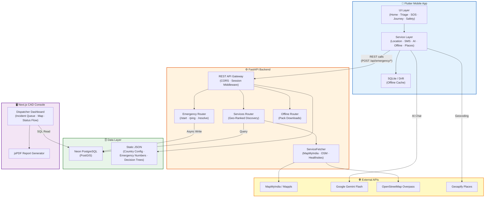

<div align="center">

# 🚨 RoadSoS — Neura

**Offline-First Road Safety Emergency Response System**

Bridging the gap between accident victims, bystanders, and emergency services — discovering ranked emergency resources in under 5 seconds with zero internet connectivity across 190+ countries.

<br>

Built for **IIT Madras Centre of Excellence in Road Safety (CoERS) Hackathon 2026**

---

</div>

## 📱 Mobile Application

<div align="center">
<table>
  <tr>
    <td align="center"><strong>Home Screen</strong></td>
    <td align="center"><strong>Emergency Triage</strong></td>
    <td align="center"><strong>SOS Tracking</strong></td>
    <td align="center"><strong>Journey Mode</strong></td>
  </tr>
  <tr>
    <td></td>
    <td></td>
    <td></td>
    <td></td>
  </tr>
</table>

<table>
  <tr>
    <td align="center"><strong>Safety Mode</strong></td>
    <td align="center"><strong>Roadside Services</strong></td>
    <td align="center"><strong>AI First Aid</strong></td>
  </tr>
  <tr>
    <td></td>
    <td></td>
    <td></td>
  </tr>
</table>
</div>

## 🖥️ Web Dispatcher Console (CAD)

<div align="center">
<<<<<<< HEAD
<table>
  <tr>
    <td align="center"><strong>CAD Dashboard</strong></td>
    <td align="center"><strong>Help Dispatch</strong></td>
  </tr>
  <tr>
    <td></td>
    <td></td>
  </tr>
</table>
=======


<p><em>CAD Dashboard — Real-Time Incident Queue &amp; Interactive Map</em></p>

<br>
>>>>>>> 5bb5cf6 (docs: update README with architectural diagrams, feature descriptions, and refreshed UI screenshots.)

<table>
  <tr>
    <td align="center"><strong>Incident Escalation Alert</strong></td>
    <td align="center"><strong>Dispatch PDF Report</strong></td>
  </tr>
  <tr>
    <td></td>
    <td></td>
  </tr>
</table>

</div>

---

## ✨ Features

| Category | Description |
|---|---|
| **One-Tap Emergency Dispatch** | 4 core crisis categories with automatic location parsing, SMS trigger dispatch to trusted circles, and live dispatcher synchronization. |
| **Geo-Adaptive Service Discovery** | Surrounding hospitals, trauma centers, police stations, and fire services automatically filtered and geo-ranked by distance with a proprietary 5-tier trust score engine. |
| **AI Guidance** | Online interactive assistance powered by Gemini Flash 1.5; fully offline emergency advice backed by preloaded Indian Red Cross decision trees. |
| **Offline-First Cache** | SQLite database (via Drift) caching local emergency lines and service indices for 190+ countries — no internet required. |
| **Journey Mode** | Live blackspot warnings and speed alerts utilizing MoRTH road accident datasets. |
| **Women Safety Mode** | Disguised silent SOS activations, instant fake call triggers, and background location tracking. |
| **CAD Web Command Center** | Next.js dispatch dashboard featuring real-time incoming queues, interactive incident mapping, status flows, and downloadable jsPDF incident logs. |

---

## 🏗️ System Architecture



---

## 🔄 How It Works

### 1. Emergency Activation (Mobile → Backend → CAD)

When a user triggers an emergency from the mobile app, the system executes a multi-stage pipeline designed for speed and resilience:

1. **Triage Screen** — The user selects one of four crisis categories (**Accident**, **Fire**, **Medical**, or **Unsafe**), specifies victim type (self, bystander, people injured, vehicle only), and optionally adds victim count and details (pediatric, trapped, senior alerts).
2. **Session Creation** — The app sends a `POST /api/emergency/start` request to the FastAPI backend, which generates a unique `session_id`, writes the emergency record to Neon PostgreSQL asynchronously (fire-and-forget), and immediately returns a response to the user — ensuring **zero-latency acknowledgement**.
3. **Live Location Pings** — While the SOS is active, the mobile app continuously streams GPS coordinates via `POST /api/emergency/ping`, which the backend logs to the `location_pings` table for real-time tracking.
4. **SMS Dispatch** — Simultaneously, the SMS service sends formatted distress messages containing the user's live location link to pre-configured emergency contacts.
5. **CAD Console** — The Next.js web dashboard reads directly from the shared Neon PostgreSQL database, rendering incoming emergencies in a real-time incident queue. Dispatchers can view incident details, track locations on an interactive map, escalate cases, and generate official PDF reports via jsPDF.

### 2. Service Discovery (Offline + Online)

The geo-adaptive service discovery engine works in two modes:

- **Online** — The `ServiceFetcher` queries MapMyIndia, OpenStreetMap Overpass, and Healthsites APIs in parallel, merges results, deduplicates by proximity, and ranks services by a proprietary **5-tier trust score** based on verification date, 24/7 availability, and source reliability.
- **Offline** — When no internet is detected, the app falls back to its local SQLite cache (via Drift), which stores pre-seeded emergency numbers for 190+ countries and nearby services downloaded during previous online sessions.

### 3. Journey Mode (Blackspot Warnings)

Journey Mode uses India's official **MoRTH road accident dataset** (13,795 blackspots on National Highways) to provide:
- Real-time proximity alerts when approaching a high-severity accident blackspot
- Speed monitoring with configurable thresholds
- Route-level risk scoring

### 4. Women Safety Mode

A dedicated safety module featuring:
- **Silent SOS** — Disguised activation (shake gesture or volume button combo) that triggers emergency dispatch without any visible on-screen indication
- **Fake Call** — Instant simulated incoming call to provide a discreet exit from unsafe situations
- **Background Tracking** — Continuous location logging shared with trusted contacts

---

## 🛠️ Installation

### 1. Clone the Repository

```bash
git clone https://github.com/smriti51818/RoadSOS_Neura.git
cd RoadSOS_Neura
```

### 2. Backend (FastAPI)

```bash
cd backend
python -m venv venv
source venv/bin/activate
pip install -r requirements.txt
```

### 3. Web Dashboard (Next.js)

```bash
cd web_dashboard
npm install
```

### 4. Mobile Client (Flutter)

```bash
cd mobile
flutter pub get
```

---

## 🚀 Usage

### Start the Backend

```bash
cd backend
source venv/bin/activate
uvicorn main:app --reload --port 8000
```

### Seed Databases *(optional)*

```bash
cd pipeline
python seed_emergency_numbers.py
python ingest_osm.py --city Mumbai --lat 19.076 --lng 72.877 --radius 25
```

### Start the Web Dashboard

```bash
cd web_dashboard
npm run dev
```

### Launch the Mobile App

```bash
cd mobile
flutter run
```

---

## ⚙️ Configuration

Create the following `.env` files before launching:

### `backend/.env`

| Variable | Description |
|---|---|
| `NEON_DATABASE_URL` | Connection URI for PostgreSQL (Neon / Supabase) |
| `MAPPLS_API_KEY` | MapMyIndia developer credentials |
| `GEMINI_API_KEY` | Gemini Flash API key |

### `mobile/.env`

| Variable | Description |
|---|---|
| `GEOAPIFY_API_KEY` | Location geocoding & Places API token |
| `API_BASE_URL` | Backend endpoint (e.g. `http://10.0.2.2:8000` for Android Emulator) |

### `web_dashboard/.env.local`

| Variable | Description |
|---|---|
| `DATABASE_URL` | Connection URI for PostgreSQL (Neon) |

---

## 📁 Project Structure

```
RoadSOS_Neura/
├── mobile/                 # Flutter cross-platform mobile app
│   └── lib/
│       ├── features/       # UI screens (home, triage, SOS, journey, safety, AI)
│       ├── services/       # Business logic (location, SMS, AI, offline, places)
│       ├── data/           # Models and local database (Drift/SQLite)
│       └── widgets/        # Shared UI components
├── backend/                # FastAPI async REST API server
│   ├── routers/            # emergency, services, offline endpoints
│   ├── core/               # Database pool, ServiceFetcher engine
│   ├── schemas/            # Pydantic request/response models
│   └── data/               # Static JSON (country config, decision trees)
├── web_dashboard/          # Next.js CAD command center
│   └── src/
│       ├── app/            # Pages and API routes
│       └── components/     # Dashboard UI (Map, IncidentTable, Charts)
├── database/               # Neon PostgreSQL migration schema (PostGIS)
├── pipeline/               # Python seeding & OSM data ingestion scripts
└── docs/                   # Documentation assets & screenshots
```
