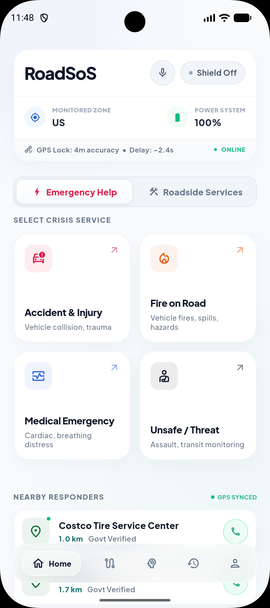
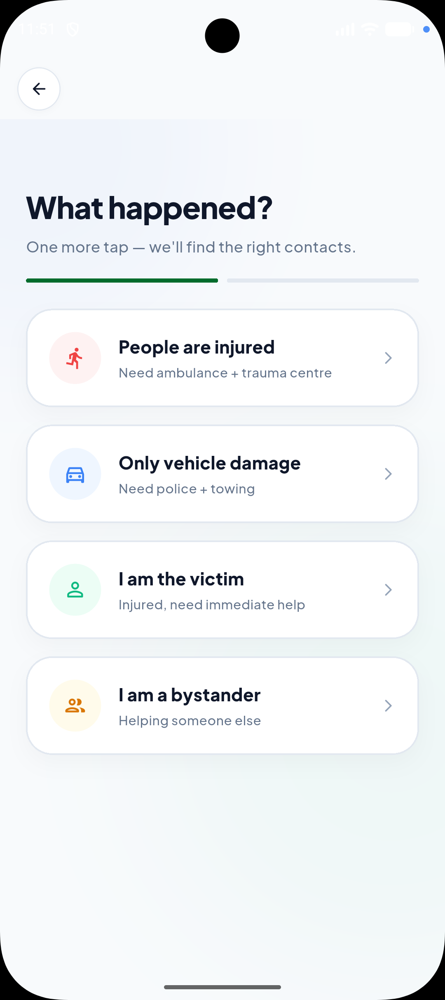
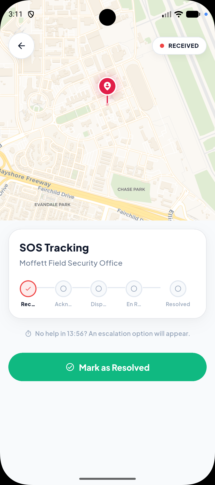
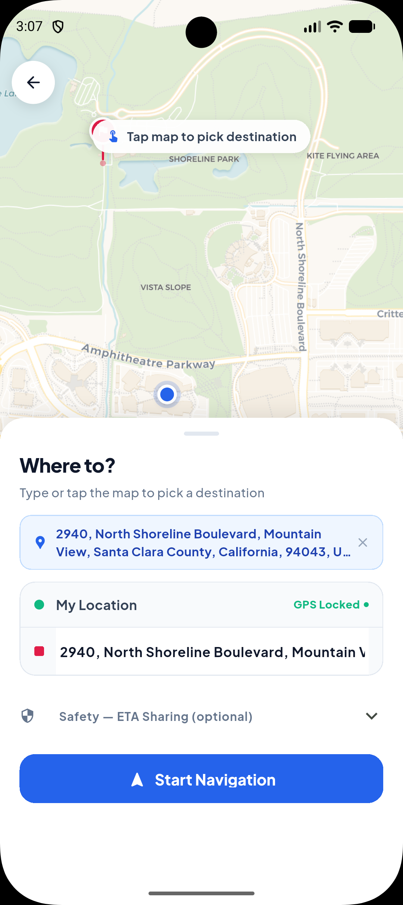
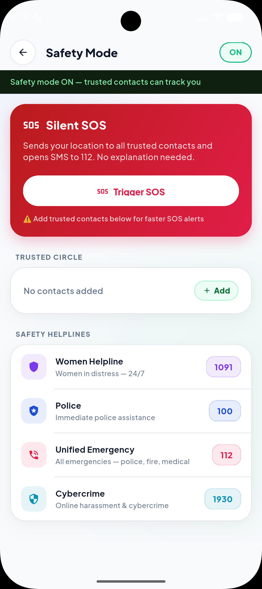
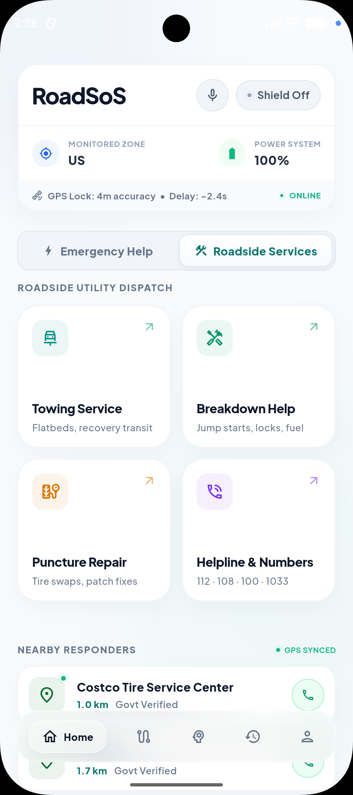
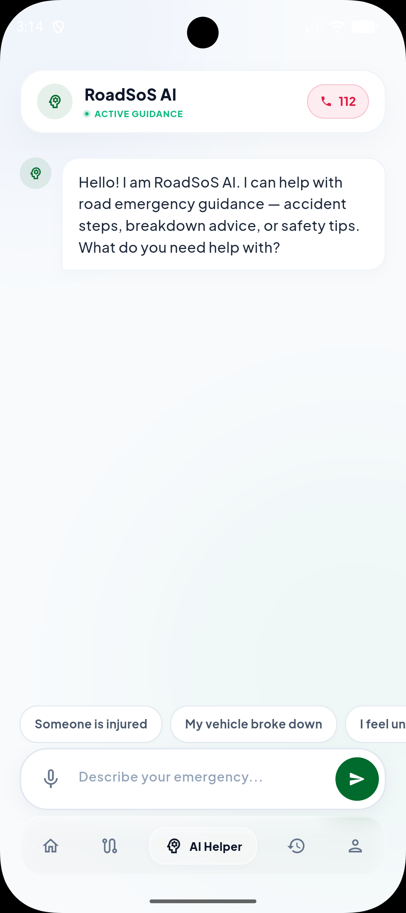
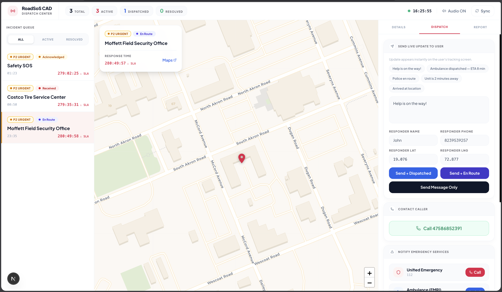
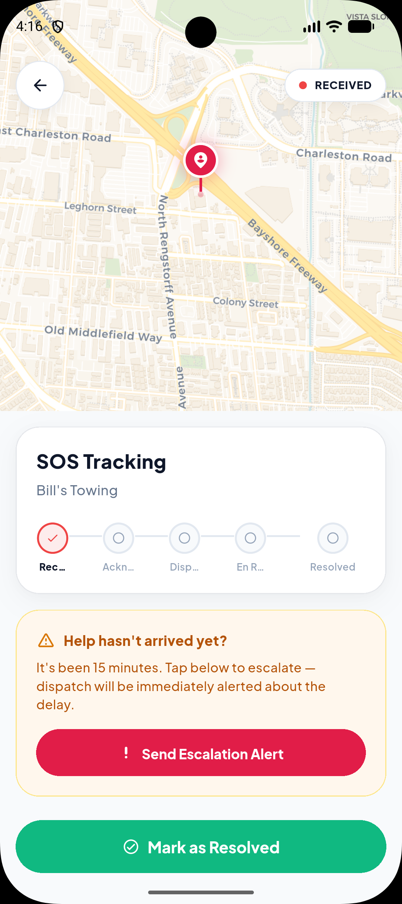
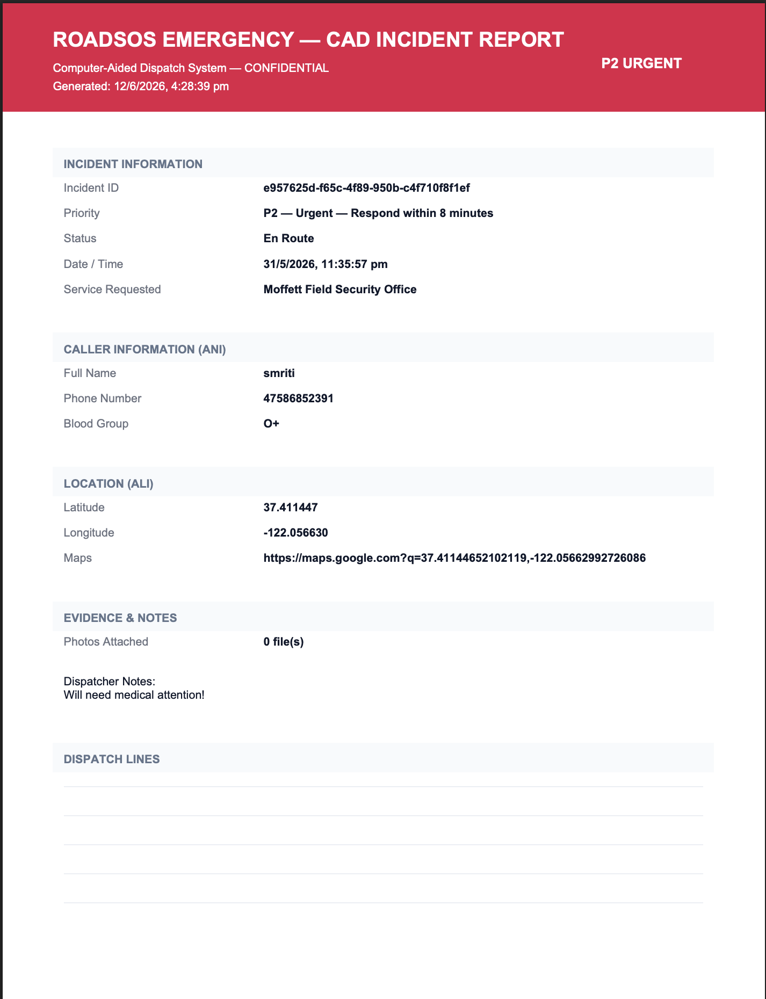

# RoadSoS — Neura

RoadSOS is a high-performance, offline-first Road Safety Emergency Response System built to bridge the gap between accident victims, bystanders, and emergency services. It discovers ranked emergency resources in under 5 seconds with zero internet connectivity across 190+ countries, while feeding live incidents to a web-based dispatcher command center.

*Built for IIT Madras Centre of Excellence in Road Safety (CoERS) Hackathon 2026.*

## Screenshots

### Mobile Application
| Home Screen | Emergency Triage | SOS Tracking |
|---|---|---|
|  |  |  |

| Journey Mode | Safety Mode | Roadside Services | AI First Aid |
|---|---|---|---|
|  |  |  |  |

### Web Dispatcher Console (CAD)
| CAD Dashboard | Incident Escalation | Dispatch PDF Report |
|---|---|---|
|  |  |  |

## Features

- **One-Tap Emergency Dispatch** — 4 core crisis categories with automatic location parsing, SMS trigger dispatch to trusted circles, and live dispatcher synchronization.
- **Geo-Adaptive Service Discovery** — Surrounding hospitals, trauma centers, police stations, and fire services automatically filtered, geo-ranked by distance, and rated using our proprietary 5-tier trust score engine.
- **AI Guidance** — Online interactive assistance powered by Gemini Flash 1.5; fully offline emergency advice backed by preloaded Indian Red Cross decision trees.
- **Offline-First Cache** — SQLite database (via Drift) caching local emergency lines and service indices for 190+ countries.
- **Journey Mode** — Live blackspot warnings and speed alerts utilizing MoRTH road accident datasets.
- **Women Safety Mode** — Disguised silent SOS activations, instant fake call triggers, and background location tracking.
- **CAD Web Command Center** — Next.js dispatch dashboard featuring real-time incoming queues, interactive incident mapping, status flows, and downloadable official jsPDF incident logs.

## Installation

### 1. Repository Setup
```bash
git clone https://github.com/smriti51818/RoadSOS_Neura.git
cd RoadSOS_Neura
```

### 2. Backend Setup
```bash
cd backend
python -m venv venv
source venv/bin/activate
pip install -r requirements.txt
```

### 3. Web Dashboard Setup
```bash
cd ../web_dashboard
npm install
```

### 4. Mobile Client Setup
```bash
cd ../mobile
flutter pub get
```

## Usage

### 1. Run Backend Service
```bash
cd backend
source venv/bin/activate
uvicorn main:app --reload --port 8000
```

### 2. Seed Databases (Optional)
```bash
cd pipeline
python seed_emergency_numbers.py
python ingest_osm.py --city Mumbai --lat 19.076 --lng 72.877 --radius 25
```

### 3. Run Web Dashboard
```bash
cd web_dashboard
npm run dev
```

### 4. Run Mobile App
```bash
cd mobile
flutter run
```

## Configuration

Ensure the following environment configurations are created before launching:

### `backend/.env`
- `NEON_DATABASE_URL` — Connection URI for PostgreSQL Database (Neon/Supabase)
- `MAPPLS_API_KEY` — MapMyIndia developer credentials
- `GEMINI_API_KEY` — Gemini Flash API key

### `mobile/.env`
- `GEOAPIFY_API_KEY` — Location geocoding Places API token
- `API_BASE_URL` — API endpoint (e.g. `http://10.0.2.2:8000` for Android Emulator)

### `web_dashboard/.env.local`
- `DATABASE_URL` — Connection URI pointing to your PostgreSQL Neon instance

## Project Structure

```text
mobile/           # Flutter cross-platform mobile app
backend/          # FastAPI async REST API server
web_dashboard/    # Next.js Computer-Aided Dispatch (CAD) command center
database/         # Neon PostgreSQL migration schema SQL
pipeline/         # Python seeding and Overpass OSM data ingestion scripts
docs/             # Documentation assets and screenshots
```
