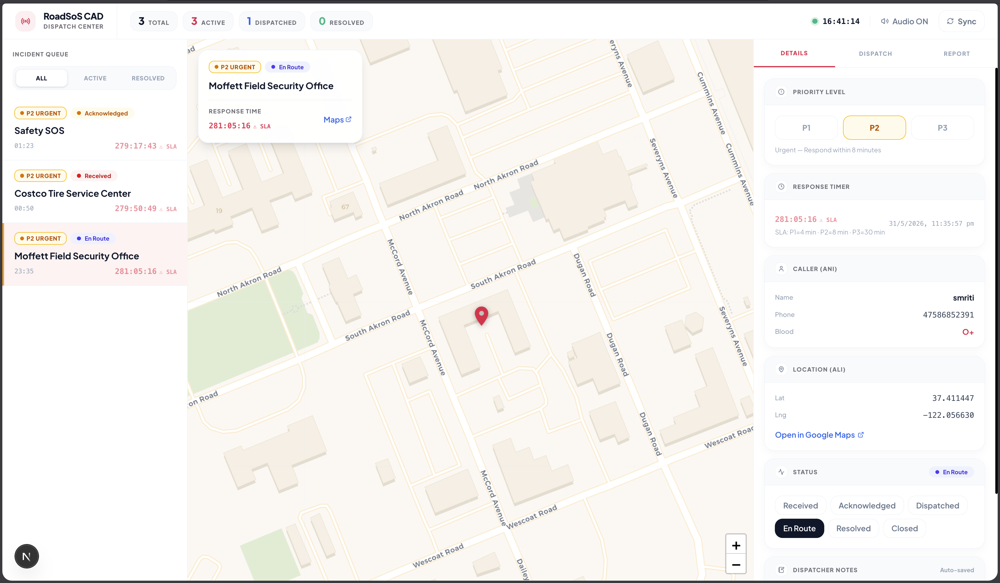

<div align="center">

# 🚨 RoadSoS — Neura

**Offline-First Road Safety Emergency Response System**

Bridging the gap between accident victims, bystanders, and emergency services — discovering ranked emergency resources in under 5 seconds with zero internet connectivity across 190+ countries.

<br>

Built for **IIT Madras Centre of Excellence in Road Safety (CoERS) Hackathon 2026**

---

</div>

## 📱 Mobile Application

<div align="center">
<table>
  <tr>
    <td align="center"><strong>Home Screen</strong></td>
    <td align="center"><strong>Emergency Triage</strong></td>
    <td align="center"><strong>SOS Tracking</strong></td>
    <td align="center"><strong>Journey Mode</strong></td>
  </tr>
  <tr>
    <td></td>
    <td></td>
    <td></td>
    <td></td>
  </tr>
</table>

<table>
  <tr>
    <td align="center"><strong>Safety Mode</strong></td>
    <td align="center"><strong>Roadside Services</strong></td>
    <td align="center"><strong>AI First Aid</strong></td>
  </tr>
  <tr>
    <td></td>
    <td></td>
    <td></td>
  </tr>
</table>
</div>

## 🖥️ Web Dispatcher Console (CAD)

<div align="center">
<table>
  <tr>
    <td align="center"><strong>CAD Dashboard</strong></td>
    <td align="center"><strong>Help Dispatch</strong></td>
  </tr>
  <tr>
    <td></td>
    <td></td>
  </tr>
</table>

<table>
  <tr>
    <td align="center"><strong>Dispatch PDF Report</strong></td>
  </tr>
  <tr>
    <td></td>
  </tr>
</table>
</div>

---

## ✨ Features

| Category | Description |
|---|---|
| **One-Tap Emergency Dispatch** | 4 core crisis categories with automatic location parsing, SMS trigger dispatch to trusted circles, and live dispatcher synchronization. |
| **Geo-Adaptive Service Discovery** | Surrounding hospitals, trauma centers, police stations, and fire services automatically filtered and geo-ranked by distance with a proprietary 5-tier trust score engine. |
| **AI Guidance** | Online interactive assistance powered by Gemini Flash 1.5; fully offline emergency advice backed by preloaded Indian Red Cross decision trees. |
| **Offline-First Cache** | SQLite database (via Drift) caching local emergency lines and service indices for 190+ countries — no internet required. |
| **Journey Mode** | Live blackspot warnings and speed alerts utilizing MoRTH road accident datasets. |
| **Women Safety Mode** | Disguised silent SOS activations, instant fake call triggers, and background location tracking. |
| **CAD Web Command Center** | Next.js dispatch dashboard featuring real-time incoming queues, interactive incident mapping, status flows, and downloadable jsPDF incident logs. |

---

## 🛠️ Installation

### 1. Clone the Repository

```bash
git clone https://github.com/smriti51818/RoadSOS_Neura.git
cd RoadSOS_Neura
```

### 2. Backend (FastAPI)

```bash
cd backend
python -m venv venv
source venv/bin/activate
pip install -r requirements.txt
```

### 3. Web Dashboard (Next.js)

```bash
cd web_dashboard
npm install
```

### 4. Mobile Client (Flutter)

```bash
cd mobile
flutter pub get
```

---

## 🚀 Usage

### Start the Backend

```bash
cd backend
source venv/bin/activate
uvicorn main:app --reload --port 8000
```

### Seed Databases *(optional)*

```bash
cd pipeline
python seed_emergency_numbers.py
python ingest_osm.py --city Mumbai --lat 19.076 --lng 72.877 --radius 25
```

### Start the Web Dashboard

```bash
cd web_dashboard
npm run dev
```

### Launch the Mobile App

```bash
cd mobile
flutter run
```

---

## ⚙️ Configuration

Create the following `.env` files before launching:

### `backend/.env`

| Variable | Description |
|---|---|
| `NEON_DATABASE_URL` | Connection URI for PostgreSQL (Neon / Supabase) |
| `MAPPLS_API_KEY` | MapMyIndia developer credentials |
| `GEMINI_API_KEY` | Gemini Flash API key |

### `mobile/.env`

| Variable | Description |
|---|---|
| `GEOAPIFY_API_KEY` | Location geocoding & Places API token |
| `API_BASE_URL` | Backend endpoint (e.g. `http://10.0.2.2:8000` for Android Emulator) |

### `web_dashboard/.env.local`

| Variable | Description |
|---|---|
| `DATABASE_URL` | Connection URI for PostgreSQL (Neon) |

---

## 📁 Project Structure

```
RoadSOS_Neura/
├── mobile/           # Flutter cross-platform mobile app
├── backend/          # FastAPI async REST API server
├── web_dashboard/    # Next.js CAD command center
├── database/         # Neon PostgreSQL migration schemas
├── pipeline/         # Python seeding & OSM data ingestion scripts
└── docs/             # Documentation assets & screenshots
```
